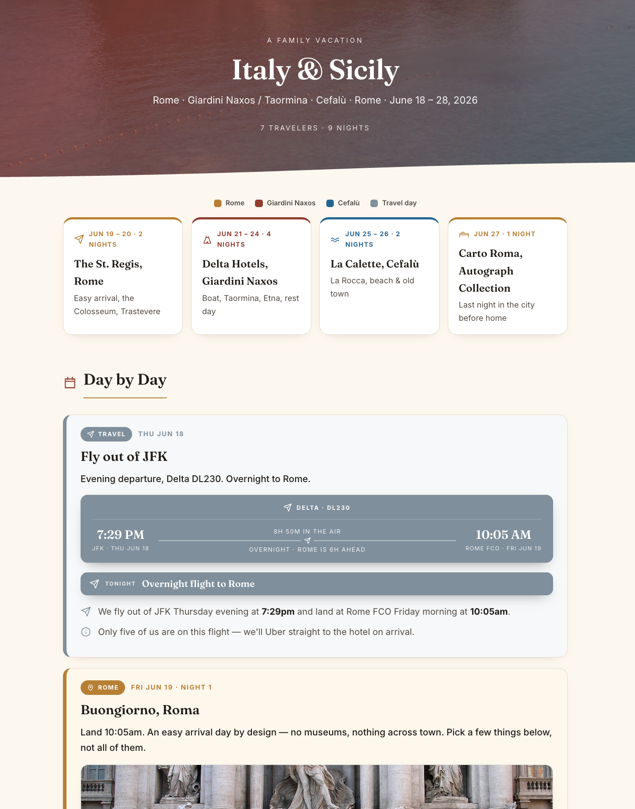

# Travel Itinerary Skill

Plan a trip and get a beautiful, living itinerary you'll actually want to share.



This is an [agent skill](https://docs.claude.com/en/docs/agents-and-tools/agent-skills/overview) that turns an AI assistant into a thoughtful travel planner. Tell it where you're going and it researches the destination, builds a gorgeous self-contained dashboard with a photo for every day, drafts the emails to your hotels and restaurants, and keeps everything up to date as your plans firm up. Drop in your booking confirmations and it files them for you.

**It works with any AI you choose.** Underneath, it's just a folder of plain-English instructions plus one small script, so any assistant that can read files can use it: Claude, Cursor, Codex, GitHub Copilot, and more. It's also built to plug into airline and hotel connectors as those arrive, so one day it can pull your reservations and book for you directly.

---

## See a real example

Here's a real trip built with this skill: **[`examples/sicily-family-trip.html`](examples/sicily-family-trip.html)** — a 10-day Italy & Sicily family itinerary. Download it and open it in your browser to see the full dashboard: a photographic hero, the route strip, a real photo for every day, and the color-coded day-by-day timeline. (It's one self-contained file, so it just opens, no setup.)

## What you get

- **A beautiful dashboard for each trip.** A single HTML page with a photographic hero, a route strip showing each stop, and a color-coded day-by-day timeline. Re-themed to the destination so it looks bespoke, not templated. Open it, share it, feel excited about your trip.
- **A real photo for every day.** A hero image of the destination, plus a photo of where you'll actually be each day, framed and captioned. This is the part people love.
- **Email help that saves hours.** Drafts clear, warm notes to hotels, restaurants, drivers, and guides, and keeps a running log of what you asked and what they confirmed.
- **Upfront research.** Starting from scratch? It scopes the right bases, the season, how to get around, and what needs booking first, then builds you a first draft to react to.
- **A drop zone for your stuff.** Paste booking confirmations, forwarded emails, or links to hotels and restaurants. It pulls out the dates, confirmation numbers, and prices and slots them into your plan.
- **Two ways to share.** A lightweight working version, and a fully self-contained version with every image embedded so it travels as one file over email or AirDrop.

## Get the skill

There are two ways to get it, depending on how you'll use it.

**Just the skill file (for the Claude app):** download [`travel-itinerary.skill`](./travel-itinerary.skill). That single file is all you need.

**The whole folder (for Cursor, Codex, Claude Code, and other agents):** click the green **Code** button near the top of this page, then **Download ZIP**, and unzip it. That gives you the `travel-itinerary` folder on your computer, no terminal required. (If you are comfortable with a terminal, you can instead run `git clone https://github.com/mattesobel/travel-itinerary-skill.git`.)

## Set it up with your AI

Pick your tool. There's nothing to build and no dependencies to install in any of them.

- **Claude — Cowork (easiest):** open the `travel-itinerary.skill` file and click **Save skill**.
- **Claude — claude.ai (web or desktop):** add the skill in your Claude settings (under Capabilities). Note: custom skills require a paid Claude plan.
- **Claude Code:** place the `travel-itinerary/` folder in your skills directory (`~/.claude/skills/`), or just point Claude Code at the folder.
- **Codex:** nothing to configure. Codex automatically reads the [`AGENTS.md`](./AGENTS.md) in this repo and follows the skill. (Codex is available on the free ChatGPT tier, with limits.)
- **Cursor:** open the folder in Cursor and tell it to "follow `travel-itinerary/SKILL.md`," or add it as a rule so it loads automatically. (Cursor's free tier works for trying it.)
- **Any other agent:** tell it to read and follow `travel-itinerary/SKILL.md`. That one file is the whole skill.

New to skills and not sure which to use? If you mostly chat with an AI, use the Claude app. If you already use a coding tool like Cursor or Codex, download the folder and point it there.

## Use it

Once it's set up, just talk to your assistant naturally:

- "Help me plan a week in Sicily in June."
- "Here's my hotel confirmation — add it to my Japan trip." *(paste it)*
- "Draft an email to the hotel asking about an airport transfer."
- "Add a day in Cefalù and rebuild the dashboard."
- "Make a shareable version I can email my family."

You don't have to have all the details. Give it what you have; it builds a first draft and pulls the rest out of you over time. It works best when your AI can also search the web (for destination research and real photos).

## How a trip is stored

Everything for a trip lives in one portable folder, so it works anywhere with any tool:

```
My Trip/
├── Brief.md                    # the source of truth (all the details, including TBDs)
├── Dashboard.html              # the beautiful living dashboard
├── Dashboard (Shareable).html  # self-contained version with images embedded
├── Emails.md                   # vendor email drafts + confirmations log
├── itinerary-images/           # the hero photo + one per day
└── _inbox/                     # optional: drop confirmations, links, screenshots here
```

## Make the shareable version

The working dashboard links to your `itinerary-images/` folder. To get one self-contained file with every image baked in:

```bash
python3 travel-itinerary/scripts/embed_images.py "My Trip/Dashboard.html"
```

This writes `My Trip/Dashboard (Shareable).html` — one file you can email or AirDrop to anyone, no folder and no internet required. (Standard library only; no dependencies.)

## What's inside the skill

```
travel-itinerary/
├── SKILL.md                       # the instructions the agent follows
├── assets/
│   ├── dashboard-template.html    # the beautiful, re-themeable dashboard
│   ├── brief-template.md          # the source-of-truth structure
│   └── vendor-emails-template.md  # the email log structure
├── references/
│   ├── imagery.md                 # hero + per-day photos: sourcing, framing, licensing
│   ├── email-playbook.md          # how to draft + track vendor emails
│   ├── research-and-ingest.md     # upfront research + parsing dropped-in inputs
│   └── integrations.md            # future airline/hotel connector hooks
└── scripts/
    └── embed_images.py            # builds the self-contained shareable dashboard
```

The repo also includes an [`AGENTS.md`](./AGENTS.md) at the root, the universal entry point that Codex, Cursor, GitHub Copilot, and other agents read automatically.

## Roadmap: connectors and direct booking

The skill works entirely by hand today. It's also built so that when travel connectors (MCP servers, airline and hotel APIs) become available, it can pull live reservation data, check flight status, and even book directly, with your approval, then file the results into your trip automatically. A connector is always an accelerant, never a requirement, so everything keeps working with or without one. See `travel-itinerary/references/integrations.md`.

## A note on photos

The skill sources real, openly-licensed images (Wikimedia Commons, Unsplash, Pexels, and similar) and keeps a credits block on every dashboard. If you're building a dashboard just for yourself, you can of course use any images you like.

## License

MIT. See [LICENSE](./LICENSE). Use it, fork it, build on it.

---

Built by Matt Sobel. If you make something cool with it, I'd love to see it.
